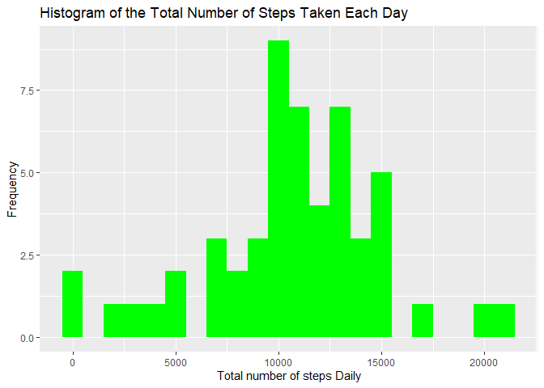
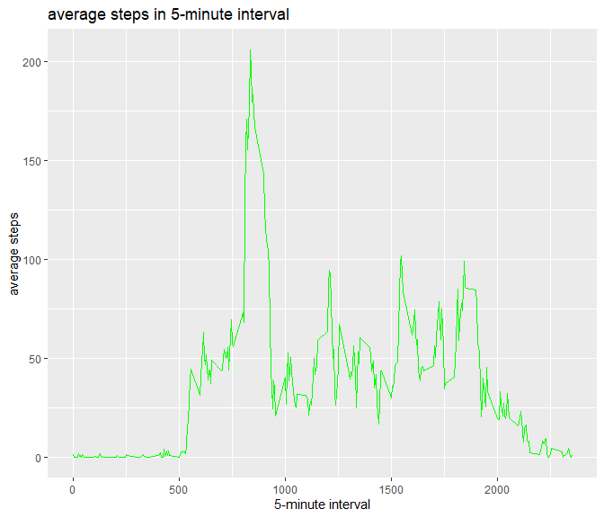
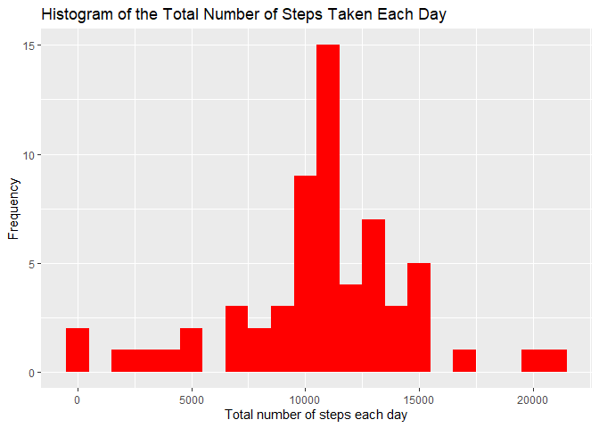
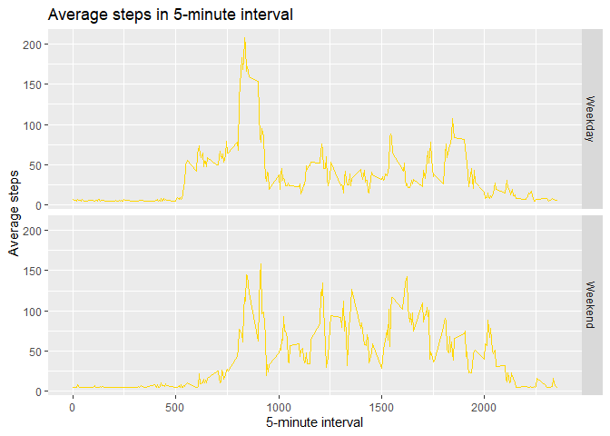

    library(ggplot2)

    ## Warning: package 'ggplot2' was built under R version 4.3.1

    library(scales)

    ## Warning: package 'scales' was built under R version 4.3.1

    library(Hmisc)

    ## Warning: package 'Hmisc' was built under R version 4.3.1

    ## 
    ## Attaching package: 'Hmisc'

    ## The following objects are masked from 'package:base':
    ## 
    ##     format.pval, units

    library(knitr)

    ## Warning: package 'knitr' was built under R version 4.3.1

    opts_chunk$set(echo = TRUE, results = TRUE, cache = TRUE)

    excelDataSourceFile <- read.csv("activity.csv")
    excelDataSourceFile$date <- as.Date(as.character(excelDataSourceFile$date))
    excelDataSourceFileNAs <- is.na(excelDataSourceFile$steps)
    cleanexcelDataSourceFile <- excelDataSourceFile[!excelDataSourceFileNAs,]

1.  Calculate the total number of steps taken per day

<!-- -->

    stepsDaily <- aggregate(steps ~ date, excelDataSourceFile, sum, na.rm = TRUE)
    print(stepsDaily)

    ##          date steps
    ## 1  2012-10-02   126
    ## 2  2012-10-03 11352
    ## 3  2012-10-04 12116
    ## 4  2012-10-05 13294
    ## 5  2012-10-06 15420
    ## 6  2012-10-07 11015
    ## 7  2012-10-09 12811
    ## 8  2012-10-10  9900
    ## 9  2012-10-11 10304
    ## 10 2012-10-12 17382
    ## 11 2012-10-13 12426
    ## 12 2012-10-14 15098
    ## 13 2012-10-15 10139
    ## 14 2012-10-16 15084
    ## 15 2012-10-17 13452
    ## 16 2012-10-18 10056
    ## 17 2012-10-19 11829
    ## 18 2012-10-20 10395
    ## 19 2012-10-21  8821
    ## 20 2012-10-22 13460
    ## 21 2012-10-23  8918
    ## 22 2012-10-24  8355
    ## 23 2012-10-25  2492
    ## 24 2012-10-26  6778
    ## 25 2012-10-27 10119
    ## 26 2012-10-28 11458
    ## 27 2012-10-29  5018
    ## 28 2012-10-30  9819
    ## 29 2012-10-31 15414
    ## 30 2012-11-02 10600
    ## 31 2012-11-03 10571
    ## 32 2012-11-05 10439
    ## 33 2012-11-06  8334
    ## 34 2012-11-07 12883
    ## 35 2012-11-08  3219
    ## 36 2012-11-11 12608
    ## 37 2012-11-12 10765
    ## 38 2012-11-13  7336
    ## 39 2012-11-15    41
    ## 40 2012-11-16  5441
    ## 41 2012-11-17 14339
    ## 42 2012-11-18 15110
    ## 43 2012-11-19  8841
    ## 44 2012-11-20  4472
    ## 45 2012-11-21 12787
    ## 46 2012-11-22 20427
    ## 47 2012-11-23 21194
    ## 48 2012-11-24 14478
    ## 49 2012-11-25 11834
    ## 50 2012-11-26 11162
    ## 51 2012-11-27 13646
    ## 52 2012-11-28 10183
    ## 53 2012-11-29  7047

1.  Create histogram of the total number of steps taken each day

<!-- -->

    totStepsPerDayHistogram <- ggplot(data = na.omit(stepsDaily), aes(x = steps)) + 
            geom_histogram(fill = "green", binwidth = 1000) +
            xlab("Total number of steps Daily") +
            ylab("Frequency") +
            ggtitle("Histogram of the Total Number of Steps Taken Each Day")
    print(totStepsPerDayHistogram)

1.  Calculate and report the mean and median of the total number of
    steps taken per day

<!-- -->

    stepsDailyMean <- mean(stepsDaily$steps, na.rm = TRUE)
    print(stepsDailyMean)

    ## [1] 10766.19

    stepsDailyMedian <- median(stepsDaily$steps, na.rm = TRUE)
    print(stepsDailyMedian)

    ## [1] 10765

## What is the average daily activity pattern?

1.  Make a time series plot (i.e. type=“l”) of the 5-minute interval
    (x-axis) and the average number of steps taken, averaged across all
    days (y-axis)

<!-- -->

    average <- aggregate(steps ~ interval, excelDataSourceFile, mean, na.rm = TRUE)
    library(ggplot2)
    timePlot <- ggplot(data = average, aes(x = interval, y = steps)) +
            geom_line(color = "green") +
            xlab("5-minute interval") +
            ylab("average steps") +
            ggtitle("average steps in 5-minute interval")
    print(timePlot)

1.  Which 5-minute interval, on average across all the days in the
    dataset, contains the maximum number of steps?

<!-- -->

    names(average)[1] = "Intervals"
    names(average)[2] = "Average_steps"
    head(average, 15)

    ##    Intervals Average_steps
    ## 1          0     1.7169811
    ## 2          5     0.3396226
    ## 3         10     0.1320755
    ## 4         15     0.1509434
    ## 5         20     0.0754717
    ## 6         25     2.0943396
    ## 7         30     0.5283019
    ## 8         35     0.8679245
    ## 9         40     0.0000000
    ## 10        45     1.4716981
    ## 11        50     0.3018868
    ## 12        55     0.1320755
    ## 13       100     0.3207547
    ## 14       105     0.6792453
    ## 15       110     0.1509434

    intervalMax <- average[which.max(average$Average_steps),]
    intervalMax

    ##     Intervals Average_steps
    ## 104       835      206.1698

## Imputing missing values

1.  Calculate and report the total number of missing values in the
    dataset (i.e. the total number of rows with NAs)

<!-- -->

    totalNas <- sum(excelDataSourceFileNAs)
    totalNas

    ## [1] 2304

1.  Devise a strategy for filling in all of the missing values in the
    dataset. The strategy does not need to be sophisticated. For
    example, you could use the mean/median for that day, or the mean for
    that 5-minute interval, etc.

2.  Create a new dataset that is equal to the original dataset but with
    the missing data filled in.

<!-- -->

    missingValues <- is.na(excelDataSourceFile)
    table(missingValues)

    ## missingValues
    ## FALSE  TRUE 
    ## 50400  2304

    imputing <- excelDataSourceFile
    imputing$steps <- impute(excelDataSourceFile$steps, mean)
    sum(is.na(imputing$steps))

    ## [1] 0

1.  Make a histogram of the total number of steps taken each day and
    Calculate and report the mean and median total number of steps taken
    per day. Do these values differ from the estimates from the first
    part of the assignment? What is the impact of imputing missing data
    on the estimates of the total daily number of steps?

<!-- -->

    sumImputing <- aggregate(steps ~ date, imputing, sum)
    names(sumImputing)[1] = "date"
    names(sumImputing)[2] = "Imputedsteps"
    head(sumImputing, 20)

    ##          date Imputedsteps
    ## 1  2012-10-01     10766.19
    ## 2  2012-10-02       126.00
    ## 3  2012-10-03     11352.00
    ## 4  2012-10-04     12116.00
    ## 5  2012-10-05     13294.00
    ## 6  2012-10-06     15420.00
    ## 7  2012-10-07     11015.00
    ## 8  2012-10-08     10766.19
    ## 9  2012-10-09     12811.00
    ## 10 2012-10-10      9900.00
    ## 11 2012-10-11     10304.00
    ## 12 2012-10-12     17382.00
    ## 13 2012-10-13     12426.00
    ## 14 2012-10-14     15098.00
    ## 15 2012-10-15     10139.00
    ## 16 2012-10-16     15084.00
    ## 17 2012-10-17     13452.00
    ## 18 2012-10-18     10056.00
    ## 19 2012-10-19     11829.00
    ## 20 2012-10-20     10395.00

    q4HistsumImpute <- ggplot(data = sumImputing, aes(x = Imputedsteps)) +
            geom_histogram(fill = "red", binwidth = 1000) +
            xlab("Total number of steps each day") +
            ylab("Frequency") +
            ggtitle("Histogram of the Total Number of Steps Taken Each Day")
    print(q4HistsumImpute)

    mean(sumImputing$Imputedsteps)

    ## [1] 10766.19

    median(sumImputing$Imputedsteps)

    ## [1] 10766.19

#### The mean and median of the original data with NAs: mean = 10766.19 and median=1076.

#### The mean and median of the imputed data without NA: mean = 10766.19 and median = 10766.19.

#### There’s no significant differecet between the two sets of data.

## Are there differences in activity patterns between weekdays and weekends?

1.  Create a new factor variable in the dataset with two levels -
    “weekday” and “weekend” indicating whether a given date is a weekday
    or weekend day.

<!-- -->

    imputing$dating <- ifelse(as.POSIXlt(imputing$date)$wday %in% c(0,6), "Weekend", "Weekday")
    head(imputing)

    ##     steps       date interval  dating
    ## 1 37.3826 2012-10-01        0 Weekday
    ## 2 37.3826 2012-10-01        5 Weekday
    ## 3 37.3826 2012-10-01       10 Weekday
    ## 4 37.3826 2012-10-01       15 Weekday
    ## 5 37.3826 2012-10-01       20 Weekday
    ## 6 37.3826 2012-10-01       25 Weekday

1.  Make a panel plot containing a time series plot (i.e.type=“l”) of
    the 5-minute interval (x-axis) and the average number of steps
    taken, averaged across all weekday days or weekend days (y-axis).

<!-- -->

    meanImputing <- aggregate(steps ~ interval + dating, imputing, mean)
    head(meanImputing)

    ##   interval  dating    steps
    ## 1        0 Weekday 7.006569
    ## 2        5 Weekday 5.384347
    ## 3       10 Weekday 5.139902
    ## 4       15 Weekday 5.162124
    ## 5       20 Weekday 5.073235
    ## 6       25 Weekday 6.295458

    panelPlot <- ggplot(data = meanImputing, aes(x = interval, y = steps)) +
            geom_line(color = "gold") +
            facet_grid(dating ~ .) +
            xlab("5-minute interval") +
            ylab("Average steps") +
            ggtitle("Average steps in 5-minute interval")
    print(panelPlot)

